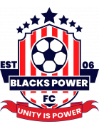

# Blacks Power FC Official Website



Welcome to the official repository for the **Blacks Power FC** website! Blacks Power FC are the reigning 2025/2026 FUFA Big League Champions and are looking forward to a great season in the Uganda Premier League.

## 🚀 Overview

This is a modern web application built with **Next.js**, **React**, **Tailwind CSS**, and **Framer Motion**. It serves as the digital home for Blacks Power FC, showcasing:
- Club news and updates
- The official first team squad and coaching staff
- Match fixtures and results
- Information for fans and partners

## 🛠️ Technology Stack

- **Framework**: [Next.js (App Router)](https://nextjs.org)
- **Styling**: [Tailwind CSS](https://tailwindcss.com/)
- **Animations**: [Framer Motion](https://www.framer.com/motion/)
- **Icons**: [Lucide React](https://lucide.dev/)
- **UI Components**: Custom components built with `Radix UI` and `class-variance-authority` (shadcn/ui inspired)

## 📦 Getting Started

First, make sure you have Node.js installed on your machine.

1. Clone the repository and navigate to the project directory:
   ```bash
   git clone <repository-url>
   cd blackspower
   ```

2. Install the dependencies:
   ```bash
   npm install
   ```

3. Run the development server:
   ```bash
   npm run dev
   ```

4. Open [http://localhost:3000](http://localhost:3000) with your browser to see the result.

## 📂 Project Structure

- `/app`: Contains the Next.js App Router pages (Home, Team, Fixtures, etc.) and layouts.
- `/components`: Reusable React components (UI elements, Player Cards, News Cards, Navbar, Footer).
- `/public`: Static assets including images and the club logo.
- `/lib`: Utility functions and configuration files.

## 🤝 Contributing

Contributions, issues, and feature requests are welcome! Feel free to check the issues page if you want to contribute to the project.

## 🏆 Unity is Power

*EST 2006*
